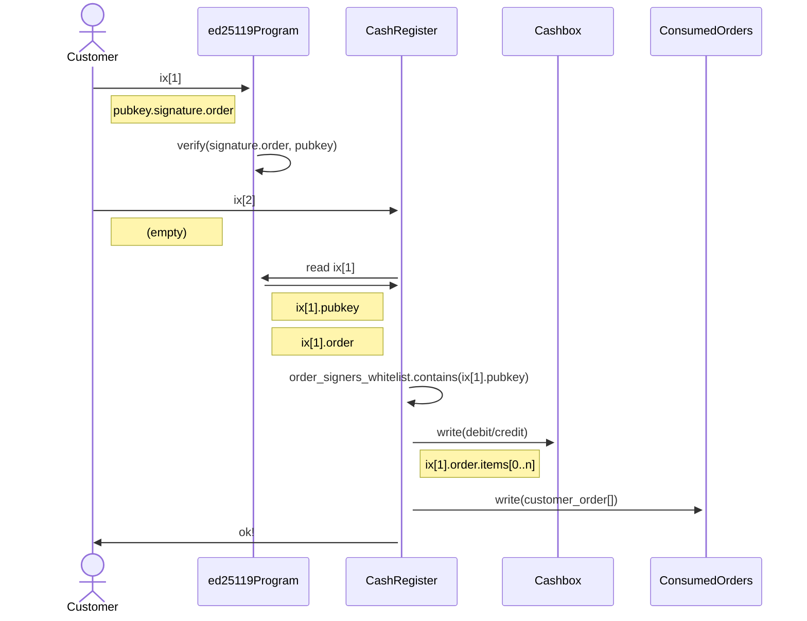

# UnCaged Studios - Solana Program Library

All Solana programs (i.e. Smart Contracts) developed by UnCaged Studios, along with their typescript SDK.

## Ka-Ching Cash Register

Ka-Ching Cash Register is an on-chain point-of-sale (PoS) solana program designed to perform on-chain settlement of signed orders created off-chain.

### Features
- Stateless and multi-tenancy: Every user (referred to as a "Cashier") can create their own set of accounts required for operating the PoS and have their users (referred to as "Customers") pay/receive tokens to/from the cashboxes associated with their specific PoS instance (a "Cash Register"). No global state or connection exists between different Cashiers or Customers' data.
- Generic Order Model: Settling on-chain payment is done based on an ed25519-signed order payload, which consists of an array of items in the format "debit/credit customer with n amount of mint X" and order metadata such as the customer address and expiry. The order is signed off-chain and the signer's public keys have to be pre-configured per Cash Register. Verifying the order payload signature is done on-chain via the Ed25519SigVerify program.
- Funds Management: A Cashier must create a Cashbox for each mint they want their users to be able to send/receive. The program assumes that the required Customer's associated token accounts already exist. Withdrawing funds from cashboxes to a Cashier's wallet is done by issuing a "credit" order.
APIs

### Instruction

The program provides different instructions for both Cashiers and Customers:

- **Cashier**: create_cash_register(), create_token_cashbox(), update_order_signers_whitelist()
- **Customer**: settle_order_payment()

### Settle Payment Txn

- The customer sends an instruction to the ed25119Program with a public key, signature, and order.
- The ed25119Program verifies the signature of the order using the provided public key.
- The customer sends an instruction to the CashRegister with no data.
- The CashRegister retrieves the public key and order from the previous instruction to the ed25119Program, and checks if the public key is on the order_signers_whitelist.
- The CashRegister writes a debit or credit to the Cashbox based on the items in the order.
- The CashRegister writes the customer's order to the ConsumedOrders and sends a confirmation message to the customer.

