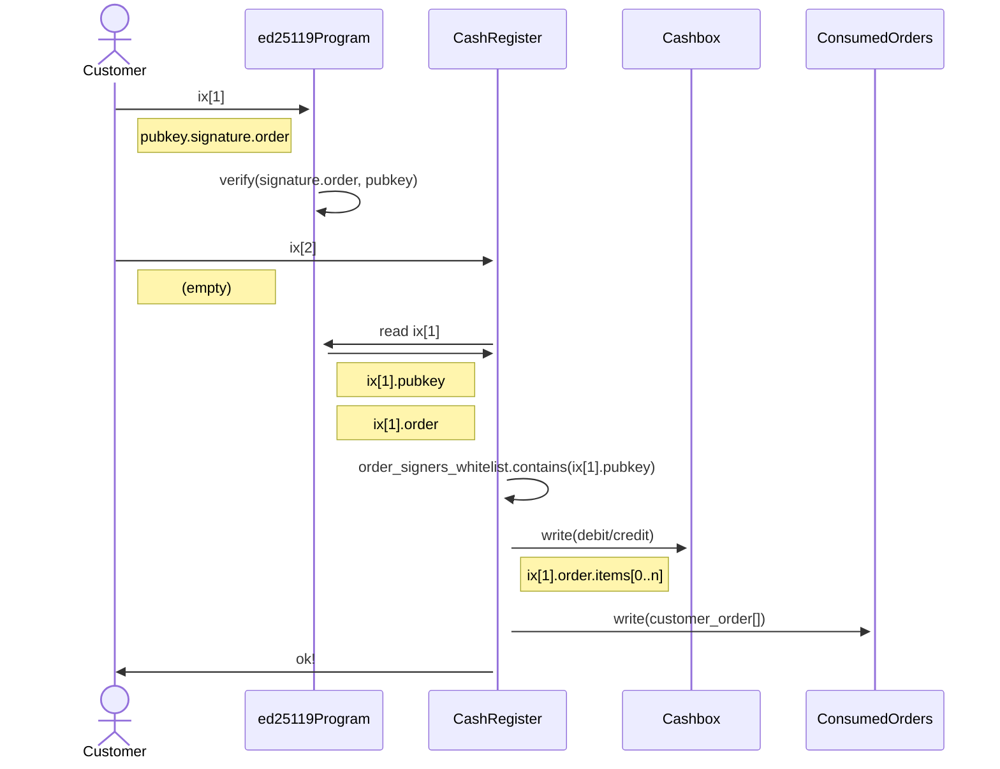

# Ka-Ching Cash Register

> ## ⚠️ Disclaimer
> The Ka-Ching on-chain program is a work in progress and may contain bugs or other issues. Use of this program is at your own risk and we cannot be held responsible for any damages or losses that may result from its use. Please exercise caution and thoroughly test the program before using it in a production environment.

## Overview

Ka-Ching is a solana program that functions as an on-chain point-of-sale (PoS) system. 

It is designed to perform on-chain settlement of signed orders created off-chain. The program allows for stateless and multi-tenant operation, meaning that each user (referred to as a "Cashier") can create their own accounts and have their users (referred to as "Customers") pay and receive tokens to and from associated cashboxes. 

It uses a generic order model, where payment is settled based on a signed order payload consisting of an array of items and metadata such as the customer address and expiry. 

## Features
- Stateless and multi-tenancy: Every user (referred to as a "Cashier") can create their own set of accounts required for operating the PoS and have their users (referred to as "Customers") pay/receive tokens to/from the cashboxes associated with their specific PoS instance (a "Cash Register"). No global state or connection exists between different Cashiers or Customers' data.
- Generic Order Model: Settling on-chain payment is done based on an ed25519-signed order payload, which consists of an array of items in the format "debit/credit customer with n amount of mint X" and order metadata such as the customer address and expiry. The order is signed off-chain and the signer's public keys have to be pre-configured per Cash Register. Verifying the order payload signature is done on-chain via the Ed25519SigVerify program.
- Funds Management: A Cashier must create a Cashbox for each mint they want their users to be able to send/receive. The program assumes that the required Customer's associated token accounts already exist. Withdrawing funds from cashboxes to a Cashier's wallet is done by issuing a "credit" order.
APIs.
- The program provides different methods for both Cashiers and Customers:
    - **Cashier**: create_cash_register(), create_token_cashbox(), update_order_signers_whitelist()
    - **Customer**: settle_order_payment()

## API

### Settle Payment

#### Sequence

- The customer sends an instruction to the ed25119Program with a public key, signature, and order.
- The ed25119Program verifies the signature of the order using the provided public key.
- The customer sends an instruction to the CashRegister with no data.
- The CashRegister retrieves the public key and order from the previous instruction to the ed25119Program, and checks if the public key is on the order_signers_whitelist.
- The CashRegister writes a debit or credit to the Cashbox based on the items in the order.
- The CashRegister writes the customer's order to the ConsumedOrders and sends a confirmation message to the customer.

#### Code Spec

[src code]([url](https://github.com/UnCaged-Studios/solana-program-library/blob/72a9c79681a232157804701cdea2ebcd859f2e7a/programs/kaching-cash-register/src/lib.rs#L55))

- The public key of the order signer and the signed order payload are retrieved from the Context object.
- The public key of the order signer is checked against the order_signers_whitelist for the CashRegister account. If it is not on the list, an error is returned.
- The signed order payload is deserialized to extract the details of the order.
- The cash_register_id in the order is compared to the cash_register_id provided in the method arguments, and the customer associated with the order is compared to the customer account in the Context object. If either check fails, an error is returned.
- The order's expiry and not_before values are checked to see if the order has expired or if it is not valid yet. If either check fails, an error is returned.
- The consumed_orders account in the Context object is checked against the consumed_orders account associated with the CashRegister account. If they do not match, an error is returned.
- The consumed_orders account is checked to see if the order has already been consumed by looking up its ID. If the order has already been consumed, an error is returned.
- The items in the order are iterated over and the appropriate debit or credit operation is performed on the customer's and cashbox's associated token accounts (ATAs).
- The consumed_orders account is updated to mark the order as consumed.
- A success result is returned.
