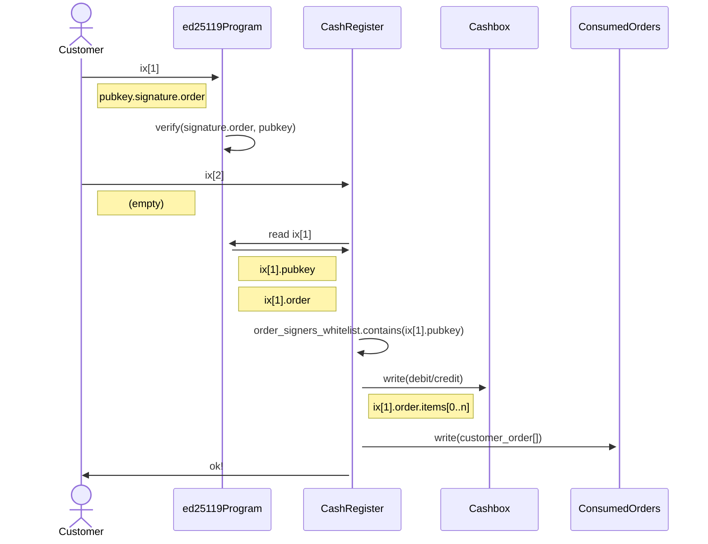

# Ka-Ching Cash Register

> ⚠️ The Ka-Ching program is a work in progress and may contain bugs or other issues. Use of this program is at your own risk and we cannot be held responsible for any damages or losses that may result from its use. Please exercise caution and thoroughly test the program before using it in a production environment.

## Overview

Ka-Ching is a solana program that functions as an on-chain point-of-sale (PoS) system. It is designed to perform on-chain settlement of signed orders created off-chain.

### 👩‍ 👨 Multi-tenancy

Every user (referred to as a "Cashier") can create their own set of accounts required for operating the PoS and have their users (referred to as "Customers") pay/receive tokens to/from the cashboxes associated with their specific PoS instance (a "Cash Register")

### 🗒️ Generic Off-Chain Order

Settling on-chain payment is done based on an ed25519-signed order payload, which is signed off-chain. This allows greater security and control over the payment process, as the Cashier can dynamically ensure that only authorized signers are able to create valid orders, without deploying any additional code on-chain or creating costly accounts. Additionally, signing the order off-chain allows for more flexibility implementing advanced payment scenarios, as the order can be created and signed in any environment that supports signing, rather than being limited to the on-chain environment.

### 🏦 Funds Management

A Cashier must create a Cashbox for each mint they want their users to be able to send/receive. The program assumes that the required Customer's associated token accounts already exist. Withdrawing funds from cashboxes to a Cashier's wallet is done by issuing a "credit" order.

## API
In the Ka-Ching on-chain program, there are different methods for the cashier and for the customer.

#### Customer is the person making a payment or receiving a payment through the PoS system
The customer method allows to settle a payment by providing a signed order, which includes the details of the payment (e.g. which customer is making the payment, which token is being used, and the amount of the payment).

#### Cashier is the person or entity operating the PoS System
The Cashier methods allow to set up and manage the PoS system, including creating a CashRegister account, creating a Cashbox for each type of token that can be used in the system, and updating the list of order signers who are authorized to sign orders on behalf of the cashier

### `settle_order_payment`

Used by the customer to settle a payment on-chain. This method is called when the customer submits a signed order to the PoS system, and it is used to verify the order and perform the appropriate debit or credit operation on the customer's and cashbox's associated token accounts (ATAs).

To settle a payment, the settle_order_payment method performs the following steps:

- It relies on previous successful ed25119Program instruction and extract from it the order signer public key.
- It checks if the public key of the order signer is on the order_signers_whitelist for the CashRegister account. If not, it returns an error.
- It checks if the cash_register_id in the order matches the cash_register_id provided in the method arguments, and if the customer associated with the order matches the customer account in the Context object. If either check fails, it returns an error.
- It checks if the order has expired or if it is not valid yet based on its expiry and not_before values. If either check fails, it returns an error.
- It checks if the order has already been consumed by looking up its ID in the consumed_orders account. If the order has already been consumed it returns an error.
- It iterates over the items in the order and performs the appropriate debit or credit operation on the customer's and cashbox's associated token accounts (ATAs).
- It updates the consumed_orders account to mark the order as consumed.
- It returns a success result.

### `create_cash_register`

The create_cash_register method is used by the cashier.

The CashRegister account is used to manage the state of the PoS instance, including the list of order signers who are authorized to sign orders on behalf of the cashier, the list of consumed orders (i.e. orders that have already been settled and cannot be used again), and the consumed orders seed (which is used to for consumed-orders data bloom-filter implementation).

Once the new CashRegister account is created, the cashier can use it to manage the PoS system and settle payments made by customers.

### `create_token_cashbox`

The create_token_cashbox method is used by the cashier.

The Cashbox account is used to store the funds received by the PoS system, and to perform debit and credit operations on the associated token accounts (ATAs) of the customers making payments and receiving payments.

Once the new Cashbox account is created, the cashier can use it to manage the funds received by the PoS system and to perform debit and credit operations on the associated token accounts of the customers. This allows the cashier to track the funds received and spent through the PoS system and to ensure that the correct amounts are credited and debited to the appropriate accounts.

## `update_order_signers_whitelist`

The update_order_signers_whitelist method is used by the cashier to update the list of order signers who are authorized to sign orders on behalf of the cashier. This is an important security measure, as it allows the cashier to control who is able to sign orders and make payments on behalf of the PoS instance.

Once the list of order signers has been updated, the cashier can use it to verify that the orders received from customers have been signed by an authorized order signer. This ensures that only valid orders are accepted and processed by the PoS instance, and helps to prevent unauthorized or fraudulent payments from being made.
