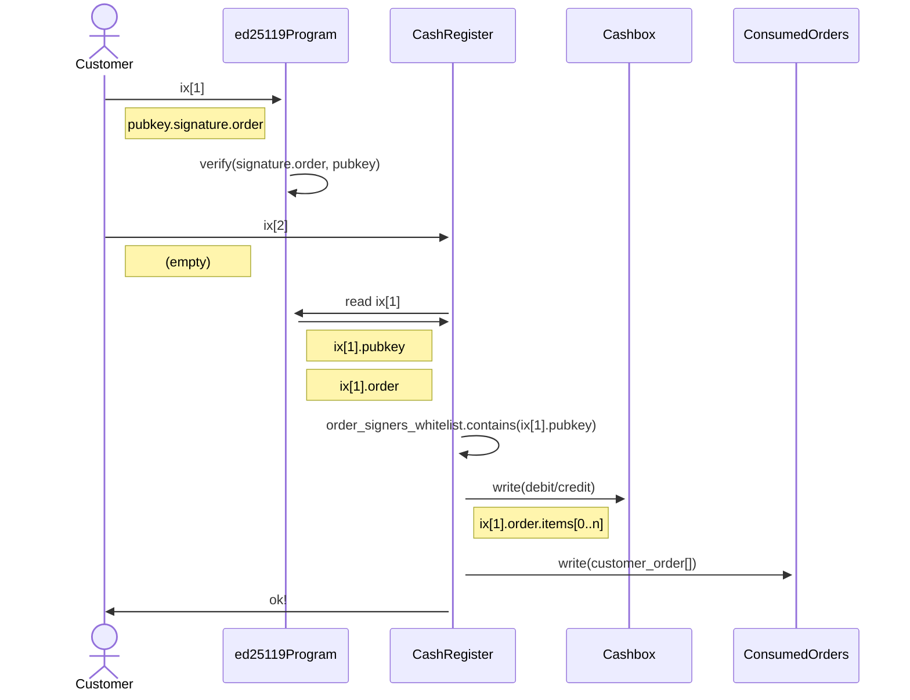

# Ka-Ching Cash Register

> ## ⚠️ Disclaimer
> The Ka-Ching on-chain program is a work in progress and may contain bugs or other issues. Use of this program is at your own risk and we cannot be held responsible for any damages or losses that may result from its use. Please exercise caution and thoroughly test the program before using it in a production environment.

## Overview

Ka-Ching is a solana program that functions as an on-chain point-of-sale (PoS) system. 

It is designed to perform on-chain settlement of signed orders created off-chain. The program allows for stateless and multi-tenant operation, meaning that each user (referred to as a "Cashier") can create their own accounts and have their users (referred to as "Customers") pay and receive tokens to and from associated cashboxes. 

It uses a generic order model, where payment is settled based on a signed order payload consisting of an array of items and metadata such as the customer address and expiry. 

## Key Features
- Stateless and multi-tenancy: Every user (referred to as a "Cashier") can create their own set of accounts required for operating the PoS and have their users (referred to as "Customers") pay/receive tokens to/from the cashboxes associated with their specific PoS instance (a "Cash Register"). No global state or connection exists between different Cashiers or Customers' data.
- Generic Order Model: Settling on-chain payment is done based on an ed25519-signed order payload, which consists of an array of items in the format "debit/credit customer with n amount of mint X" and order metadata such as the customer address and expiry. The order is signed off-chain and the signer's public keys have to be pre-configured per Cash Register. Verifying the order payload signature is done on-chain via the Ed25519SigVerify program.
- Funds Management: A Cashier must create a Cashbox for each mint they want their users to be able to send/receive. The program assumes that the required Customer's associated token accounts already exist. Withdrawing funds from cashboxes to a Cashier's wallet is done by issuing a "credit" order.
APIs.

## API

### Overview

In the Ka-Ching on-chain program, there are different methods for the cashier and for the customer. The cashier is the person or entity operating the point-of-sale (PoS) system, while the customer is the person making a payment or receiving a payment through the PoS system.

The cashier methods in the Ka-Ching program include create_cash_register, create_token_cashbox, and update_order_signers_whitelist. These methods allow the cashier to set up and manage the PoS system, including creating a CashRegister account, creating a Cashbox for each type of token that can be used in the system, and updating the list of order signers who are authorized to sign orders on behalf of the cashier.

The customer methods in the Ka-Ching program include settle_order_payment. This method allows the customer to settle a payment by providing a signed order, which includes the details of the payment (e.g. which customer is making the payment, which token is being used, and the amount of the payment). The settle_order_payment method checks the signed order to verify that it is valid and has not been consumed before, and then performs the appropriate debit or credit operation on the customer's and cashbox's associated token accounts.

### Settle Payment

#### Sequence

- The customer sends an instruction to the ed25119Program with a public key, signature, and order.
- The ed25119Program verifies the signature of the order using the provided public key.
- The customer sends an instruction to the CashRegister with no data.
- The CashRegister retrieves the public key and order from the previous instruction to the ed25119Program, and checks if the public key is on the order_signers_whitelist.
- The CashRegister writes a debit or credit to the Cashbox based on the items in the order.
- The CashRegister writes the customer's order to the ConsumedOrders and sends a confirmation message to the customer.

#### Code Spec

[src code]([url](https://github.com/UnCaged-Studios/solana-program-library/blob/72a9c79681a232157804701cdea2ebcd859f2e7a/programs/kaching-cash-register/src/lib.rs#L55))

- The public key of the order signer and the signed order payload are retrieved from the Context object.
- The public key of the order signer is checked against the order_signers_whitelist for the CashRegister account. If it is not on the list, an error is returned.
- The signed order payload is deserialized to extract the details of the order.
- The cash_register_id in the order is compared to the cash_register_id provided in the method arguments, and the customer associated with the order is compared to the customer account in the Context object. If either check fails, an error is returned.
- The order's expiry and not_before values are checked to see if the order has expired or if it is not valid yet. If either check fails, an error is returned.
- The consumed_orders account in the Context object is checked against the consumed_orders account associated with the CashRegister account. If they do not match, an error is returned.
- The consumed_orders account is checked to see if the order has already been consumed by looking up its ID. If the order has already been consumed, an error is returned.
- The items in the order are iterated over and the appropriate debit or credit operation is performed on the customer's and cashbox's associated token accounts (ATAs).
- The consumed_orders account is updated to mark the order as consumed.
- A success result is returned.

The settle_order_payment method is used by the customer (the person or entity making a payment through the point-of-sale (PoS) system) to settle a payment on the solana blockchain. This method is called when the customer submits a signed order to the PoS system, and it is used to verify the order and perform the appropriate debit or credit operation on the customer's and cashbox's associated token accounts (ATAs).

To settle a payment, the settle_order_payment method performs the following steps:

It retrieves the public key of the order signer and the signed order payload from the Context object.
It checks if the public key of the order signer is on the order_signers_whitelist for the CashRegister account. If not, it returns an error.
It deserializes the signed order payload to extract the details of the order.
It checks if the cash_register_id in the order matches the cash_register_id provided in the method arguments, and if the customer associated with the order matches the customer account in the Context object. If either check fails, it returns an error.
It checks if the order has expired or if it is not valid yet based on its expiry and not_before values. If either check fails, it returns an error.
It checks if the consumed_orders account in the Context object matches the consumed_orders account associated with the CashRegister account. If not, it returns an error.
It checks if the order has already been consumed by looking up its ID in the consumed_orders account. If the order has already been consumed
It iterates over the items in the order and performs the appropriate debit or credit operation on the customer's and cashbox's associated token accounts (ATAs).
It updates the consumed_orders account to mark the order as consumed.
It returns a success result.

To settle a payment order, the settle_order_payment method takes the following arguments:

cash_register_id: The ID of the CashRegister account associated with the PoS system. This is used to verify that the order is intended for the correct PoS system.
order_id: The ID of the payment order to be settled.
signature: The signature of the payment order, signed by the order signer.
order: The payload of the payment order, containing the details of the payment (e.g. the amount, the type of token, the customer's account, etc.).

### `create_cash_register`

The create_cash_register method is used by the cashier (the person or entity operating the point-of-sale (PoS) system) to create a new CashRegister account on the solana blockchain. The CashRegister account is used to manage the state of the PoS system, including the list of order signers who are authorized to sign orders on behalf of the cashier, the list of consumed orders (i.e. orders that have already been settled and cannot be used again), and the consumed orders seed (which is used to generate unique IDs for each order).

To create a new CashRegister account, the create_cash_register method takes the following arguments:

owner: The public key of the account that will own the new CashRegister account.
consumed_orders: The public key of the account that will be used to store the list of consumed orders for this CashRegister.
order_signers_whitelist: The public key of the account that will be used to store the list of order signers who are authorized to sign orders on behalf of the cashier.
Once the new CashRegister account is created, the cashier can use it to manage the PoS system and settle payments made by customers.

### `create_token_cashbox`

The create_token_cashbox method is used by the cashier (the person or entity operating the point-of-sale (PoS) system) to create a new Cashbox account on the solana blockchain. The Cashbox account is used to store the funds received by the PoS system, and to perform debit and credit operations on the associated token accounts (ATAs) of the customers making payments and receiving payments through the PoS system.

To create a new Cashbox account, the create_token_cashbox method takes the following arguments:

token_type: The type of token that will be used in the Cashbox.
initial_balance: The initial balance of the Cashbox. This is the amount of token that will be deposited in the Cashbox when it is created.
owner: The public key of the account that will own the new Cashbox account.
Once the new Cashbox account is created, the cashier can use it to manage the funds received by the PoS system and to perform debit and credit operations on the associated token accounts of the customers. This allows the cashier to track the funds received and spent through the PoS system and to ensure that the correct amounts are credited and debited to the appropriate accounts.

## `update_order_signers_whitelist` 

The update_order_signers_whitelist method is used by the cashier (the person or entity operating the point-of-sale (PoS) system) to update the list of order signers who are authorized to sign orders on behalf of the cashier. This is an important security measure, as it allows the cashier to control who is able to sign orders and make payments on behalf of the PoS system.

To update the list of order signers, the update_order_signers_whitelist method takes the following arguments:

add: A list of public keys of order signers to be added to the whitelist.
remove: A list of public keys of order signers to be removed from the whitelist.
Once the list of order signers has been updated, the cashier can use it to verify that the orders received from customers have been signed by an authorized order signer. This ensures that only valid orders are accepted and processed by the PoS system, and helps to prevent unauthorized or fraudulent payments from being made.
